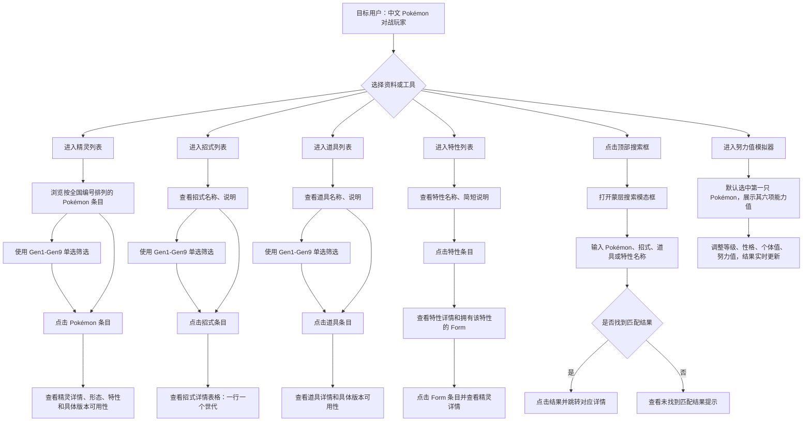

# PRD: Pokémon 中文资料站
## 版本更新说明（v5 → v6）
- 重建机器可读层：补上此前缺失的 `.ab/prd.json` 与 `.ab/questions.json`（正文早已在引用其中的编号）。
- 招式 / 特性数据导入进本期，作为 F003 / F004 / F007 / F008 的前置（Q-036）。
- 列表页不再展示版本名称，版本信息只留在详情页的「具体版本可用性」（Q-037）。
- 特性详情的列表统一为 **Form 列表**，正文里「拥有该特性的 Pokémon 列表」的旧措辞已改（Q-009 · Q-041）。
- AC-024 改写为世代表格，与 F004 / Q-007 对齐（Q-042）。
- 补 AC-074（能力值与游戏一致）与 AC-075（详情页服务端渲染可被收录）；性能 2 秒维持为目标不进 AC（Q-040）。
- 明确路由 `[name]` 段传英文 slug（Q-043）；AC-049 归属改到 US008（Q-044）。
- 清掉悬空的「待确认」：§风险的「默认入口未确认」、§建议补充问题 8 条、§编辑页 / §删除（Q-045 · Q-046）。

## 版本更新说明（v4 → v5）
- 新增「特性列表」与「特性详情」为 P0 独立资料对象。
- 顶部搜索模态框搜索范围从 Pokémon / 招式 / 道具扩展为 Pokémon / 招式 / 道具 / 特性。
- 特性详情新增「拥有该特性的 Pokémon 列表」，并支持跳转到对应精灵详情。
- 页面清单由 8 个模块扩展为 10 个模块：新增特性列表、特性详情。
- 核心流程新增「特性列表 → 特性详情 → 精灵详情」浏览路径。
- 明确用户系统不进入 P0，首版不包含登录、收藏、个人数据、权限、投稿审核、后台管理。
- 清理模板残留：不保留「文件与外部集成规格」章节，不展开文件、导入导出或外部实时集成。
- 清理错误生成内容：不把资料对象强行设计为用户侧状态流转对象。
- 保持努力值模拟器为独立页面，用户进入后选择 Pokémon 进行计算。
- 保持顶部搜索为全站组件，不作为独立搜索页面。

## 概述
**版本**: 6.0  
**创建日期**: 2026-09-03  
**最近更新**: 2026-09-15
**负责人**: jie

### 产品一句话说明
面向中文 Pokémon 对战玩家的轻量资料网站，提供精灵、招式、道具、特性资料浏览，以及独立努力值模拟器。

### 背景与核心问题
用户希望围绕 Pokémon 对战构筑场景，快速查询精灵、招式、道具、特性等资料，并通过努力值模拟器进行能力值相关计算。首版以稳定、可控的资料展示和基础工具为核心。

### 维度完整度总览
✅ Goal · Users · Pain · Metrics · Flow · P0 · NFR · Exception · Scope

归一化后全部维度均已落定，无悬而未决的待确认项；每条结论都能溯源到 `.ab/questions.json` 里的一条裁决。

## 目标与成功指标

### 产品目标
建立一个中文 Pokémon 资料站，首版支持精灵、招式、道具、特性资料浏览，以及独立努力值模拟器，服务 Pokémon 对战相关查询与计算场景。

### 目标用户
中文 Pokémon 对战玩家，尤其是已经了解基本规则、会使用 Pokémon Showdown 或进行实机对战，并需要快速查资料和辅助构筑决策的用户。

### 用户痛点
- 查询 Pokémon 对战相关资料时，需要在多个资料源之间切换。
- 用户希望按精灵、招式、道具、特性快速浏览资料。
- 用户希望通过名称搜索快速定位 Pokémon、招式、道具或特性。
- 用户希望有独立努力值模拟器，选择 Pokémon 后进行努力值相关计算。

### 成功指标
| 指标 | 目标 |
|---|---|
| 资料覆盖 | Pokémon、招式、道具、特性资料可支撑首版列表与详情浏览 |
| 搜索可用性 | 顶部搜索模态框支持按名称搜索 Pokémon / 招式 / 道具 / 特性，并可跳转详情 |
| 努力值模拟器准确性 | 六项能力值计算结果与游戏一致；输入由控件约束在合法范围内 |
| 基础性能 | 详情页首屏加载目标约 2 秒；搜索和筛选结果尽量 1 秒内返回 |
| 基础搜索引擎收录 | 精灵、招式、道具、特性详情页具备基础搜索引擎收录能力 |

### 指标与演示边界

#### 内部成功指标
用于产品评估，不默认进入用户界面。

| 指标 | 用途 | 是否默认进入用户界面 |
|---|---|---|
| 详情页加载时间 | 评估资料浏览体验 | 否 |
| 搜索响应时间 | 评估搜索体验 | 否 |
| 努力值计算准确性 | 评估工具可靠性 | 否 |
| 核心结构化数据完整性 | 评估资料可信度 | 否 |

#### 用户可见指标
| 指标 | 展示页面 | 口径 | 时间范围 | 是否可点击钻取 | 可见角色 |
|---|---|---|---|---|---|
| 具体游戏版本名称 | 精灵详情、招式详情、道具详情、特性详情 | `VersionI18n` 的中文版本名，文字标签（Q-008）；列表页不展示版本（Q-037） | 全部 53 个版本 | 否 | 资料浏览用户 |
| 具体版本可用性 | 精灵详情、招式详情、道具详情、特性详情 | 该对象在哪些版本中可用 | 全部 53 个版本 | 否 | 资料浏览用户 |

#### 原型/演示辅助能力
不适用：演示直接用库中真实数据，见 §示例数据与演示说明。

## 功能清单

### P0
| 功能ID | 功能名称 | 功能描述 | 用户价值 | 备注 |
|---|---|---|---|---|
| F001 | 精灵列表 | 展示 Pokémon 条目，按全国编号排列；支持 Gen1-Gen9 单选筛选 | 用户可按编号浏览 Pokémon，并按世代筛选 | 列表不展示版本，版本信息只在详情页（Q-037） |
| F002 | 精灵详情 | 同一个全国编号对应一个 Pokémon 页面；同一全国编号下的不同形态在同一页面展示；展示该 Pokémon 资料、特性资料字段和更完整的具体版本可用性 | 用户可查看单个 Pokémon 的核心资料 | 特性作为精灵详情资料字段展示 |
| F003 | 招式列表 | 展示招式名称、说明；支持 Gen1-Gen9 单选筛选 | 用户可浏览和筛选招式资料 | 列表不展示版本（Q-037），也不展示属性、分类、威力、命中、PP |
| F004 | 招式详情 | 一张表格：一行一个世代（Gen1–Gen9），列为 属性/分类/威力/命中/PP | 用户一眼看出这招哪一代改过 | 按**世代**而非版本：库中 `MoveGeneration` 主键 `[moveId, generationId]`，一招最多 9 行 |
| F005 | 道具列表 | 展示道具名称、说明；支持 Gen1-Gen9 单选筛选 | 用户可浏览和筛选道具资料 | 列表不展示版本（Q-037）；道具方向参考 52poke |
| F006 | 道具详情 | 展示道具名称、说明、版本名称，以及具体版本可用性 | 用户可查看单个道具资料 | seed 的 156 条道具目前 `descriptions` 全为空，说明会走「说明暂缺」 |
| F007 | 特性列表 | 展示特性名称、简短说明 | 用户可浏览特性资料条目 | 列表不展示版本（Q-037）；特性进入 P0 独立资料对象 |
| F008 | 特性详情 | 展示特性名称、详细说明、版本名称，以及拥有该特性的 Form 列表 | 用户可查看特性详情，并找到拥有该特性的宝可梦形态 | Form 条目可跳转精灵详情；是 Form 不是 Pokemon（Q-009 · Q-041） |
| F009 | 努力值模拟器 | 独立页面；用户进入后选择 Pokémon，并进行努力值相关计算 | 用户可进行能力值相关模拟 | 核心结构化数据由入库和数据库层保证正确与完整 |
| F010 | 顶部搜索模态框 | 顶部搜索框触发蒙层搜索模态框；按名称搜索 Pokémon / 招式 / 道具 / 特性；点击结果跳转详情 | 用户可快速定位资料对象 | 搜索模态框不展示版本信息、不参与版本筛选 |

### P1
本期不规划：P0 十个功能目前只完成一个，先做完 P0（Q-020）。

### P2
本期不规划（Q-020）。

## 核心流程

### 核心流程
1. 用户从精灵列表进入精灵详情。
2. 用户从招式列表进入招式详情。
3. 用户从道具列表进入道具详情。
4. 用户从特性列表进入特性详情，并可从拥有该特性的 Form 列表跳转到精灵详情。
5. 用户通过顶部搜索模态框按名称搜索 Pokémon / 招式 / 道具 / 特性，并跳转对应详情。
6. 用户进入努力值模拟器页面，选择 Pokémon 后进行努力值相关计算。

#### 精灵浏览流程
1. 用户进入精灵列表。
2. 用户浏览按全国编号排列的 Pokémon 条目。
3. 用户可在列表页使用 Gen1-Gen9 单选筛选。
4. 用户点击某个 Pokémon 条目。
5. 用户进入该 Pokémon 的精灵详情页。
6. 用户在详情页查看同一全国编号下的形态信息、特性资料字段和具体版本可用性。

#### 招式浏览流程
1. 用户进入招式列表。
2. 用户浏览招式条目。
3. 列表展示招式名称、说明。
4. 用户可在列表页使用 Gen1-Gen9 单选筛选。
5. 用户点击某个招式。
6. 用户进入招式详情页。
7. 用户在详情页看到一张表格，一行一个世代，列出该世代的属性、分类、威力、命中、PP。

#### 道具浏览流程
1. 用户进入道具列表。
2. 用户浏览道具条目。
3. 列表展示道具名称、说明。
4. 用户可在列表页使用 Gen1-Gen9 单选筛选。
5. 用户点击某个道具。
6. 用户进入道具详情页。
7. 用户在详情页查看该道具的名称、说明、版本名称和更完整的具体版本可用性。

#### 特性浏览流程
1. 用户进入特性列表。
2. 用户浏览特性条目。
3. 列表展示特性名称、简短说明。
4. 用户点击某个特性。
5. 用户进入特性详情页。
6. 用户查看特性名称、详细说明、版本名称，以及拥有该特性的 Form 列表。
7. 用户可点击 Form 条目进入对应精灵详情。

#### 顶部搜索流程
1. 用户通过顶部搜索框触发搜索模态框。
2. 用户在搜索模态框中输入 Pokémon、招式、道具或特性名称。
3. 系统展示匹配结果，结果用于帮助用户识别并跳转。
4. 用户点击某条搜索结果后，进入对应的精灵详情、招式详情、道具详情或特性详情。

#### 努力值模拟流程
1. 用户进入努力值模拟器页面。
2. 页面默认选中列表第一只 Pokémon，并展示其六项能力值。
3. 用户按需切换 Pokémon，调整等级、性格、个体值、努力值。
4. 任一输入变化，模拟器立即重算六项能力值。

### 用户流程图

## 页面地图与信息架构（必填）

### 页面清单

| 页面 ID | 路由 | 页面名 |
|---|---|---|
| PAGE-001 | `/` | 首页导航 |
| PAGE-002 | `/pokemon` | 精灵列表 |
| PAGE-003 | `/pokemon/[name]` | 精灵详情 |
| PAGE-004 | `/move` | 招式列表 |
| PAGE-005 | `/move/[name]` | 招式详情 |
| PAGE-006 | `/item` | 道具列表 |
| PAGE-007 | `/item/[name]` | 道具详情 |
| PAGE-008 | `/ability` | 特性列表 |
| PAGE-009 | `/ability/[name]` | 特性详情 |
| PAGE-010 | `/effort-values` | 努力值模拟器 |

路由里的 `[name]` 段传的是**英文 slug**（`Pokemon.slug` / `Move.slug` / `Item.slug` / `Ability.slug`，库中均为唯一键），不是中文名 —— 见 Q-043。

顶部搜索模态框是全站组件，不占路由（原文：「保持顶部搜索为全站组件，不作为独立搜索页面」），因此不在本表与 `.ab/prd.json` 的 `pages` 中。

本期没有自建 API 端点：数据经 `/api/graphql` 的单一 GraphQL 端点读取，字段契约在 `graphql/schema/*/schema.graphql`。

| 页面名称 | 平台/端 | 使用角色 | 页面层级 | 上级页面 | 进入方式 | 一级入口依据 | 页面目标 | 主要模块 | 主要操作 | 可跳转页面 | 空态/默认态 |
|---|---|---|---|---|---|---|---|---|---|---|---|
| 精灵列表 `/pokemon` | PC 浏览器优先 | 资料浏览用户 | 一级页面 | 无 | 从首页 `/` 的导航进入 | Pokémon 资料浏览核心入口 | 浏览 Pokémon 条目 | Pokémon 条目、全国编号、Gen1-Gen9 单选筛选 | 浏览、筛选、点击条目 | 精灵详情 | 当前筛选条件下暂无结果 |
| 精灵详情 `/pokemon/[name]` | PC 浏览器优先 | 资料浏览用户 | 二级页面 | 精灵列表 / 顶部搜索模态框 / 特性详情 | 点击 Pokémon 条目或搜索结果 | 从列表、搜索或特性详情进入 | 查看单个 Pokémon 资料 | Pokémon 资料、形态展示、特性资料字段、具体版本可用性 | 查看资料、点面包屑 | 面包屑回 `/pokemon` | 加载中 / 未找到该 Pokémon |
| 招式列表 `/move` | PC 浏览器优先 | 资料浏览用户 | 一级页面 | 无 | 从首页 `/` 的导航进入 | 招式资料浏览核心入口 | 浏览招式条目 | 招式名称、说明、Gen1-Gen9 单选筛选 | 浏览、筛选、点击条目 | 招式详情 | 当前筛选条件下暂无结果 |
| 招式详情 `/move/[name]` | PC 浏览器优先 | 资料浏览用户 | 二级页面 | 招式列表 / 顶部搜索模态框 | 点击招式条目或搜索结果 | 从列表或搜索进入 | 查看单个招式详情 | 世代表格：属性/分类/威力/命中/PP | 查看资料、点面包屑 | 面包屑回 `/move` | 加载中 / 未找到该招式 |
| 道具列表 `/item` | PC 浏览器优先 | 资料浏览用户 | 一级页面 | 无 | 从首页 `/` 的导航进入 | 道具资料浏览核心入口 | 浏览道具条目 | 道具名称、说明、Gen1-Gen9 单选筛选 | 浏览、筛选、点击条目 | 道具详情 | 当前筛选条件下暂无结果 |
| 道具详情 `/item/[name]` | PC 浏览器优先 | 资料浏览用户 | 二级页面 | 道具列表 / 顶部搜索模态框 | 点击道具条目或搜索结果 | 从列表或搜索进入 | 查看单个道具详情 | 名称、说明、版本名称、具体版本可用性 | 查看资料、点面包屑 | 面包屑回 `/item` | 加载中 / 未找到该道具 |
| 特性列表 `/ability` | PC 浏览器优先 | 资料浏览用户 | 一级页面 | 无 | 从首页 `/` 的导航进入 | 特性资料浏览核心入口 | 浏览特性条目 | 特性名称、简短说明 | 浏览、点击条目 | 特性详情 | 当前暂无特性数据 |
| 特性详情 `/ability/[name]` | PC 浏览器优先 | 资料浏览用户 | 二级页面 | 特性列表 / 顶部搜索模态框 | 点击特性条目或搜索结果 | 从列表或搜索进入 | 查看单个特性详情 | 特性名称、详细说明、版本名称、拥有该特性的 Form 列表 | 查看资料、点击 Form 条目 | 精灵详情 | 加载中 / 未找到该特性 |
| 努力值模拟器 `/effort-values` | PC 浏览器优先 | 资料浏览用户 | 一级页面 | 首页导航 | 从首页 `/` 的导航进入 | 对战辅助工具核心入口 | 调整参数查看六项能力值 | Pokémon 选择、等级、性格、个体值、努力值、计算结果 | 切换 Pokémon、调整参数 | 停留在本页 | 无空态：默认选中第一只即出结果 |
| 顶部搜索模态框 | PC 浏览器优先 | 资料浏览用户 | 全站组件 | 当前页面 | 顶部搜索框触发 | 全站快速定位资料对象 | 按名称搜索并跳转详情 | 搜索输入框、搜索结果列表 | 输入名称、点击结果 | 精灵详情 / 招式详情 / 道具详情 / 特性详情 | 未输入关键词时不展示结果列表 |

### 导航骨架与默认落点
| 角色 | 一级导航项（按顺序） | 默认落点页面 | 选择依据 |
|---|---|---|---|
| 资料浏览用户 | 精灵列表、招式列表、道具列表、特性列表、努力值模拟器 | 首页 `/` 导航页 | 已由 `app/page.tsx` 实现：首页即导航页，列出 5 个一级入口（Q-004） |

## 页面职责与模块边界（必填）

| 页面 | 核心用户任务 | 必须展示 | 可选展示 | 不应展示 | 关键 CTA | 页面完成标准 |
|---|---|---|---|---|---|---|
| 精灵列表 `/pokemon` | 浏览并选择 Pokémon | Pokémon 条目、全国编号、Gen1-Gen9 单选筛选 | 形态缩略图 | 属性、种族值、招式表等详情页字段 | 点击 Pokémon 条目 | 用户进入对应精灵详情 |
| 精灵详情 `/pokemon/[name]` | 查看单个 Pokémon 资料 | Pokémon 资料、同全国编号下形态展示、特性资料字段、具体版本可用性 | 图鉴说明、图鉴颜色 | 编辑 / 删除等写操作（本期只读） | 点面包屑回 `/pokemon` | 用户能查看该 Pokémon 的资料内容 |
| 招式列表 `/move` | 浏览并选择招式 | 招式名称、说明、Gen1-Gen9 单选筛选 | 所属世代 | 属性、分类、威力、命中、PP | 点击招式条目 | 用户进入对应招式详情 |
| 招式详情 `/move/[name]` | 查看单个招式详情 | 世代表格：行 = Gen1–Gen9，列 = 属性/分类/威力/命中/PP | 加载中 / 未找到该招式 | 无 | 点击面包屑回 `/move` | 用户能对比该招式各世代的数值 |
| 道具列表 `/item` | 浏览并选择道具 | 道具名称、说明、Gen1-Gen9 单选筛选 | 所属世代 | 道具效果全文 | 点击道具条目 | 用户进入对应道具详情 |
| 道具详情 `/item/[name]` | 查看单个道具详情 | 道具名称、说明、版本名称、具体版本可用性 | 所属版本组 | 编辑 / 删除等写操作（本期只读） | 点面包屑回 `/item` | 用户能查看该道具资料 |
| 特性列表 `/ability` | 浏览并选择特性 | 特性名称、简短说明 | 所属世代 | 详细说明、拥有该特性的 Form 列表 | 点击特性条目 | 用户进入对应特性详情 |
| 特性详情 `/ability/[name]` | 查看单个特性详情 | 特性名称、详细说明、版本名称、拥有该特性的 Form 列表 | 按世代切换（本期不做） | 编辑 / 删除等写操作（本期只读） | 点击 Form 条目 | 用户能查看特性资料并跳转到拥有该特性的形态 |
| 努力值模拟器 `/effort-values` | 调整参数查看六项能力值 | Pokémon 选择、等级、性格、个体值、努力值、六项结果 | 种族值明细 | 老世代数据（库中只有最新世代） | 切换 Pokémon / 调整参数 | 用户能看到随输入实时更新的六项能力值 |
| 顶部搜索模态框 | 按名称快速定位资料对象 | 搜索输入框、匹配结果 | 结果类型标记（精灵/招式/道具/特性） | 版本信息、版本筛选 | 点击搜索结果 | 用户进入对应详情页 |

## 基础管理对象页面规则（适用时必填）

### 列表页
| 对象 | 展示字段 | 默认排序 | 搜索筛选是否支持 | 空态 | 行点击行为 |
|---|---|---|---|---|---|
| Pokémon | 条目、全国编号 | 全国编号 | 支持 Gen1-Gen9 单选筛选；顶部搜索模态框按名称搜索 | 当前筛选条件下暂无结果 | 进入精灵详情 |
| 招式 | 名称、说明 | 英文 slug 字母序 | 支持 Gen1-Gen9 单选筛选；顶部搜索模态框按名称搜索 | 当前筛选条件下暂无结果 | 进入招式详情 |
| 道具 | 名称、说明 | 英文 slug 字母序 | 支持 Gen1-Gen9 单选筛选；顶部搜索模态框按名称搜索 | 当前筛选条件下暂无结果 | 进入道具详情 |
| 特性 | 名称、简短说明 | 英文 slug 字母序 | 顶部搜索模态框按名称搜索 | 当前暂无特性数据 | 进入特性详情 |

### 详情页
| 对象 | 字段 | 状态 | 操作按钮 | 返回路径 |
|---|---|---|---|---|
| Pokémon | Pokémon 资料、形态、特性资料字段、具体版本可用性 | 加载中 / 未找到该 Pokémon | 无 | 面包屑固定回 `/pokemon` |
| 招式 | 世代表格：属性、分类、威力、命中、PP | 加载中 / 未找到该招式 | 无 | 面包屑固定回 `/move` |
| 道具 | 名称、说明、版本名称、具体版本可用性 | 加载中 / 未找到该道具 | 无 | 面包屑固定回 `/item` |
| 特性 | 名称、详细说明、版本名称、拥有该特性的 Form 列表（小图 + 名 + 隐藏标记） | 加载中 / 未找到该特性 | 点击 Form 条目进精灵详情 | 面包屑固定回 `/ability` |

### 编辑页
不适用：本期是公开只读资料站，不做编辑页（Q-046）。

### 删除
不适用：本期是公开只读资料站，没有删除操作（Q-046）。

### 历史/版本
不适用：本期为公开只读资料站，无编辑、无删除，因而没有版本历史。

## 多端与后台拆分（涉及时必填）

| 端/工作台 | 使用角色 | 访问入口 | 一级页面 | 核心任务 | 与其他端关系 |
|---|---|---|---|---|---|
| PC 浏览器 | 资料浏览用户 | 首页 `/` | 精灵列表、招式列表、道具列表、特性列表、努力值模拟器 | 浏览资料、搜索跳转、努力值计算 | 首版优先 |
| 移动端浏览器 | 资料浏览用户 | 首页 `/` | 与 PC 相同 | 基本可浏览 | 第一版只保证响应式可浏览 |

## 数据模型与字段 Schema（必填）

### Pokémon
| 字段名 | 类型 | 必填 | 枚举/格式 | 默认值 | 校验规则 | 是否用户可见 | 是否可编辑 | 说明 |
|---|---|---|---|---|---|---|---|---|
| 全国编号 | 整数 | 是 | 正整数 | 无（主键） | 列表按它升序 | 是 | 否 | 库中 `Pokemon.id` |
| 名称 | 文本（多语言） | 是 | 按语言取，缺则回退 | 无 | 顶部搜索按它匹配 | 是 | 否 | 库中 `PokemonI18n.name` |
| 形态信息 | 结构化数据 | 是 | Form 列表 | 默认形态（`isDefault = true`） | 同编号各形态同页展示 | 是 | 否 | 库中 `Form`；目前只导入默认形态 |
| 特性资料字段 | 结构化数据 | 否 | slot 1/2 普通、3 隐藏 | 空数组 | 按世代取 | 是 | 否 | 库中 `FormAbility`；导入路径本期建（Q-036） |
| 具体版本可用性 | 结构化数据 | 否 | 53 个版本的中文名 | 空 | 以文字标签展示，不用图标（Q-008） | 是 | 否 | 库中 `Version` + `VersionI18n` |

### 招式
| 字段名 | 类型 | 必填 | 枚举/格式 | 默认值 | 校验规则 | 是否用户可见 | 是否可编辑 | 说明 |
|---|---|---|---|---|---|---|---|---|
| 名称 | 文本（多语言） | 是 | 按语言取，缺则回退 | 无 | 顶部搜索按它匹配 | 是 | 否 | 库中 `MoveI18n.name` |
| 说明 | 文本 | **否** | 自由文本 | 无 | 为空时前端展示「说明暂缺」。库中 `MoveEffectI18n.shortEffect` 可空 | 是 | 否 | 招式列表展示说明 |
| 具体版本可用性 | 结构化数据 | 否 | 53 个版本的中文名 | 空 | 以文字标签展示，不用图标（Q-008） | 是 | 否 | 库中 `Version` + `VersionI18n` |
| 各世代的属性 | 结构化数据 | 是 | 每世代一个值 | 无 | 表格里一行一个世代 | 是 | 否 | `MoveGeneration.typeId` → 18 种属性 |
| 各世代的分类 | 结构化数据 | 是 | 每世代一个值 | 无 | 表格里一行一个世代 | 是 | 否 | `MoveCategory` 枚举：物理 / 特殊 / 变化 |
| 各世代的威力 | 结构化数据 | 否 | 每世代一个值 | 无 | 表格里一行一个世代 | 是 | 否 | `MoveGeneration.power`，变化招式为空 |
| 各世代的命中 | 结构化数据 | 否 | 每世代一个值 | 无 | 表格里一行一个世代 | 是 | 否 | `MoveGeneration.accuracy`，必中招式为空 |
| 各世代的PP | 结构化数据 | 否 | 每世代一个值 | 无 | 表格里一行一个世代 | 是 | 否 | `MoveGeneration.pp` |

### 道具
| 字段名 | 类型 | 必填 | 枚举/格式 | 默认值 | 校验规则 | 是否用户可见 | 是否可编辑 | 说明 |
|---|---|---|---|---|---|---|---|---|
| 名称 | 文本（多语言） | 是 | 按语言取，缺则回退 | 无 | 顶部搜索按它匹配 | 是 | 否 | 库中 `ItemI18n.name`，seed 有 156 条 |
| 说明 | 文本 | **否** | 自由文本 | 无 | 为空时前端展示「说明暂缺」。seed 里 156 条道具的 `descriptions` 目前全为空 | 是 | 否 | 道具说明 |
| 具体版本可用性 | 结构化数据 | 否 | 53 个版本的中文名 | 空 | 以文字标签展示，不用图标（Q-008） | 是 | 否 | 库中 `Version` + `VersionI18n` |

### 特性
| 字段名 | 类型 | 必填 | 枚举/格式 | 默认值 | 校验规则 | 是否用户可见 | 是否可编辑 | 说明 |
|---|---|---|---|---|---|---|---|---|
| 名称 | 文本（多语言） | 是 | 按语言取，缺则回退 | 无 | 顶部搜索按它匹配 | 是 | 否 | 库中 `AbilityI18n.name` |
| 简短说明 | 文本 | **否** | 自由文本 | 无 | 为空时前端展示「说明暂缺」。库中 `AbilityEffectI18n.shortEffect` 可空 | 是 | 否 | 特性列表展示 |
| 详细说明 | 文本 | 是 | 自由文本 | 无 | 库中 `AbilityEffectI18n.effect` 非空 | 是 | 否 | 特性详情展示 |
| 具体版本可用性 | 结构化数据 | 否 | 53 个版本的中文名 | 空 | 以文字标签展示，不用图标（Q-008） | 是 | 否 | 库中 `Version` + `VersionI18n` |
| 拥有该特性的 Form 列表 | 结构化数据 | 否 | 小图 + 中文名 + slot=3 标「隐藏」 | 空数组 | 点击进对应精灵详情；随世代变 | 是 | 否 | 库中 `FormAbility`（Q-009）。注意是 Form 不是 Pokemon |

### 努力值模拟器输入
| 字段名 | 类型 | 必填 | 枚举/格式 | 默认值 | 校验规则 | 是否用户可见 | 是否可编辑 | 说明 |
|---|---|---|---|---|---|---|---|---|
| Pokémon | 选择项（select） | 是 | 库内 Pokémon | **列表第一只** | 默认即选中，不存在未选择态 | 是 | 是 | 切换后按新种族值重算 |
| 等级 | 整数 | 是 | 1–100 | 50 | 控件截断，超出范围输不进去 | 是 | 是 | 计算输入 |
| 性格 | 选择项（select） | 是 | 25 种性格 | 无修正性格 | 一项 ×1.1、一项 ×0.9 | 是 | 是 | 系数表为代码常量，库中无此表 |
| 个体值 | 整数 ×6 | 是 | 0–31 | 31 | 控件截断 | 是 | 是 | HP/攻击/防御/特攻/特防/速度 各一项 |
| 努力值 | 整数 ×6 | 是 | 单项 0–252，六项总和 ≤510 | 0 | 控件截断，达上限后不再增加 | 是 | 是 | 同上六项 |
| 计算结果 | 结构化数据 | 是 | 六项能力值 | 按默认输入算出的值 | 任一输入变化即重算 | 是 | 否 | 只覆盖最新世代（见 §范围边界） |

### 状态字段枚举
| 对象 | 状态字段 | 枚举值 | 说明 |
|---|---|---|---|
| Pokémon | 无 | 无 | 公开只读资料对象，无用户侧状态流转 |
| 招式 | 无 | 无 | 公开只读资料对象，无用户侧状态流转 |
| 道具 | 无 | 无 | 公开只读资料对象，无用户侧状态流转 |
| 特性 | 无 | 无 | 公开只读资料对象，无用户侧状态流转 |
| 努力值模拟器 `/effort-values` | 无 | 无 | 无状态流转：select 默认选中第一只、输入受控件上下限约束（Q-003） |

### 示例数据与演示说明

不另编示例数据 —— 库里已有真实数据，演示直接用它：

| 类型 | 数据来源 | 规模 | 备注 |
|---|---|---|---|
| Pokémon | `prisma/seed-data/pokemon.json` | 3.3 MB | 含多语言译名、形态、种族值、属性 |
| 道具 | `prisma/seed-data/items.json` | 156 条 | `imageName` 与 `descriptions` 目前均为空，会走「说明暂缺」 |
| 版本 | `prisma/seed-data/versions.json` | 53 个 | 各带 9 种语言译名 |
| 世代 / 版本组 | `generations.json` / `groups.json` | 9 / 依数据源 | 三层结构：世代 → 版本组 → 版本 |
| 招式 | `prisma/seed-data/moves.json` | 本期导入 | seed 目前没有这个文件，导入是 F003/F004 的前置任务（Q-036） |
| 特性 | `prisma/seed-data/abilities.json` + `FormAbility` 导入路径 | 本期导入 | seed 目前没有这个文件、`FormAbility` 也没有导入路径，两者都是 F007/F008 的前置任务（Q-036） |

## 核心对象状态机（必填）

本期**没有业务状态机**。精灵、招式、道具、特性都是公开只读资料对象，不存在用户侧状态流转；核心结构化数据由入库和数据库层保证正确与完整。

努力值模拟器原先被描述为「未选择 / 可计算 / 输入非法」三态流转，经确认后作废（Q-003）：选择 Pokémon 是一个 `select` 控件、默认选中列表第一只，所以不存在「未选择」；努力值与个体值用带上下限的控件、超出范围直接截断，所以不存在「输入非法」。它只有一种正常显示状态，页面级的 loading / error 见 §异常、空态、加载态与恢复路径。

因此 `.ab/prd.json` 的 `domain.workflows` 为空 —— 不是漏写，是这个项目确实没有。

## 数据生命周期（必填）

| 阶段 | 是否创建记录 | 状态 | 用户可见位置 | 可操作项 | 是否可删除 | 是否进入统计/历史 |
|---|---|---|---|---|---|---|
| 资料对象展示 | 否（只读） | 无状态流转 | 精灵列表、招式列表、道具列表、特性列表、对应详情页 | 查看、筛选、跳转 | 否 | 否 |
| 顶部搜索 | 否 | 搜索中 / 无结果 / 失败 / 有结果 | 顶部搜索模态框 | 输入名称、点击结果 | 不适用 | 否 |
| 努力值模拟 | 否 | 无状态流转 | 努力值模拟器 | 选择 Pokémon、调整参数、查看结果 | 不适用 | 否 |

## 关键操作反馈与页面跳转（必填）

| 操作 | 触发入口 | 前置条件 | Loading/处理中状态 | 成功反馈 | 成功后默认落点 | 失败反馈 | 用户可恢复动作 | 返回路径 |
|---|---|---|---|---|---|---|---|---|
| 查看精灵详情 | 精灵列表条目 | 精灵列表加载完成 | 详情区域 loading | 进入精灵详情 | 精灵详情 | 精灵资料加载失败，请稍后再试 | 返回列表后重试 | 面包屑回 `/pokemon` |
| 查看招式详情 | 招式列表条目 | 招式列表加载完成 | 详情区域 loading | 进入招式详情 | 招式详情 | 招式资料加载失败，请稍后再试 | 返回列表后重试 | 面包屑回 `/move` |
| 查看道具详情 | 道具列表条目 | 道具列表加载完成 | 详情区域 loading | 进入道具详情 | 道具详情 | 道具资料加载失败，请稍后再试 | 返回列表后重试 | 面包屑回 `/item` |
| 查看特性详情 | 特性列表条目 | 特性列表加载完成 | 详情区域 loading | 进入特性详情 | 特性详情 | 特性资料加载失败，请稍后再试 | 返回列表后重试 | 面包屑回 `/ability` |
| 从特性详情查看 Pokémon | 特性详情中的 Form 条目 | 特性详情加载完成且存在拥有该特性的 Form | 详情区域 loading | 进入精灵详情 | 精灵详情 | 精灵资料加载失败，请稍后再试 | 返回特性详情后重试 | 面包屑回 `/pokemon`（不回特性详情） |
| 使用列表筛选 | Gen1-Gen9 单选筛选 | 列表页可用 | 列表区域 loading | 列表刷新并保留筛选条件 | 当前列表页 | 列表加载失败，请稍后再试 | 重试或调整筛选 | 当前列表页 |
| 顶部搜索 | 顶部搜索框 | 用户输入名称 | 搜索 loading | 展示匹配结果 | 搜索模态框 | 搜索暂时不可用，请稍后再试 | 保留输入并重试 | 当前页面 |
| 点击搜索结果 | 搜索模态框结果项 | 存在匹配结果 | 跳转 loading | 进入对应详情 | 精灵详情 / 招式详情 / 道具详情 / 特性详情 | 对应详情加载失败 | 重新搜索 | 面包屑回对应列表（不回搜索前页面） |
| 努力值计算 | 努力值模拟器 | 页面已加载 | 必要时展示 loading | 自动更新六项能力值 | 努力值模拟器 | 不适用（输入受控件约束） | 调整输入 | 努力值模拟器 |

## 用户故事

### US001: 浏览精灵列表
**作为** 中文 Pokémon 对战玩家  
**我希望** 浏览按全国编号排列的 Pokémon 条目  
**以便** 快速找到想查看的精灵资料

**验收标准**:
- **AC-001** 给定 用户位于精灵列表且列表加载完成 When 用户查看列表 Then 系统按全国编号展示 Pokémon 条目。
- **AC-002** 给定 用户位于精灵列表 When 用户选择 Gen1-Gen9 中某个筛选项 Then 系统刷新列表并保留筛选条件。
- **AC-003** 给定 用户首次进入精灵列表 When 页面加载完成 Then 筛选器处于未选中状态，列表展示全国图鉴全量。
- **AC-004** 给定 当前无登录体系 When 用户访问精灵列表 Then 用户可直接查看公开资料。
- **AC-005** 给定 当前筛选条件下无结果 When 列表刷新完成 Then 系统展示“当前筛选条件下暂无结果”。
- **AC-006** 给定 列表加载失败或超时 When 用户进入精灵列表 Then 系统展示“列表加载失败，请稍后再试”并提供重试入口。
- **AC-007** 给定 用户重复点击同一筛选项 When 列表请求进行中 Then 系统保持当前筛选条件，不产生错误页面。

### US002: 查看精灵详情
**作为** 中文 Pokémon 对战玩家  
**我希望** 从精灵列表选择 Pokémon 并查看详情  
**以便** 快速了解该 Pokémon 的资料和具体版本可用性

**验收标准**:
- **AC-008** 给定 用户位于精灵列表且列表加载完成 When 用户点击某个 Pokémon 条目 Then 系统进入该 Pokémon 的精灵详情。
- **AC-009** 给定 用户访问精灵详情 When 该 Pokémon 存在同全国编号下不同形态 Then 系统在同一页面展示形态信息。
- **AC-010** 给定 详情对象不存在 When 用户访问精灵详情 Then 系统展示“未找到该 Pokémon”。
- **AC-011** 给定 当前无登录体系 When 用户访问精灵详情 Then 用户可直接查看公开资料。
- **AC-012** 给定 精灵详情加载失败或超时 When 用户进入详情 Then 系统展示“精灵资料加载失败，请稍后再试”。
- **AC-013** 给定 用户重复点击同一 Pokémon 条目 When 详情请求进行中 Then 系统保持跳转到同一精灵详情，避免产生错误页面。
- **AC-014** 给定 Pokémon 图片资源异常 When 精灵详情展示 Then 系统使用占位图并保持页面布局正常。
- **AC-015** 给定 说明类文本为空 When 精灵详情展示 Then 系统展示“说明暂缺”。

### US003: 浏览招式列表
**作为** 中文 Pokémon 对战玩家  
**我希望** 浏览招式列表  
**以便** 快速找到想查看的招式资料

**验收标准**:
- **AC-016** 给定 用户位于招式列表且列表加载完成 When 用户查看列表 Then 系统展示招式名称与说明，不展示版本名称。
- **AC-017** 给定 用户位于招式列表 When 用户选择 Gen1-Gen9 中某个筛选项 Then 系统刷新列表并保留筛选条件。
- **AC-018** 给定 用户未输入搜索关键词 When 用户仅浏览招式列表 Then 系统按列表页规则展示招式条目。
- **AC-019** 给定 当前无登录体系 When 用户访问招式列表 Then 用户可直接查看公开资料。
- **AC-020** 给定 当前筛选条件下无结果 When 列表刷新完成 Then 系统展示“当前筛选条件下暂无结果”。
- **AC-021** 给定 招式列表加载失败或超时 When 用户进入列表 Then 系统展示“列表加载失败，请稍后再试”并提供重试入口。
- **AC-022** 给定 用户重复点击同一筛选项 When 列表请求进行中 Then 系统保持当前筛选条件，不产生错误页面。

### US004: 查看招式详情
**作为** 中文 Pokémon 对战玩家  
**我希望** 从招式列表选择招式并查看详情  
**以便** 对比该招式在各世代的数值差异

**验收标准**:
- **AC-023** 给定 用户位于招式列表且列表加载完成 When 用户点击某个招式条目 Then 系统进入该招式详情。
- **AC-024** 给定 用户进入招式详情 When 详情加载完成 Then 系统展示一张世代表格：一行一个世代（Gen1–Gen9），列为 属性/分类/威力/命中/PP；表格列不含说明（Q-042）。
- **AC-025** 给定 详情对象不存在 When 用户访问招式详情 Then 系统展示“未找到该招式”。
- **AC-026** 给定 当前无登录体系 When 用户访问招式详情 Then 用户可直接查看公开资料。
- **AC-027** 给定 招式详情加载失败或超时 When 用户进入详情 Then 系统展示“招式资料加载失败，请稍后再试”。
- **AC-028** 给定 用户重复点击同一招式条目 When 详情请求进行中 Then 系统保持跳转到同一招式详情，避免产生错误页面。
- **AC-029** 给定 招式说明类文本为空 When 招式详情展示 Then 系统展示“说明暂缺”。

### US005: 浏览道具列表
**作为** 中文 Pokémon 对战玩家  
**我希望** 浏览道具列表  
**以便** 快速找到想查看的道具资料

**验收标准**:
- **AC-030** 给定 用户位于道具列表且列表加载完成 When 用户查看列表 Then 系统展示道具名称与说明，不展示版本名称。
- **AC-031** 给定 用户位于道具列表 When 用户选择 Gen1-Gen9 中某个筛选项 Then 系统刷新列表并保留筛选条件。
- **AC-032** 给定 用户未输入搜索关键词 When 用户仅浏览道具列表 Then 系统按列表页规则展示道具条目。
- **AC-033** 给定 当前无登录体系 When 用户访问道具列表 Then 用户可直接查看公开资料。
- **AC-034** 给定 当前筛选条件下无结果 When 列表刷新完成 Then 系统展示“当前筛选条件下暂无结果”。
- **AC-035** 给定 道具列表加载失败或超时 When 用户进入列表 Then 系统展示“列表加载失败，请稍后再试”并提供重试入口。
- **AC-036** 给定 用户重复点击同一筛选项 When 列表请求进行中 Then 系统保持当前筛选条件，不产生错误页面。

### US006: 查看道具详情
**作为** 中文 Pokémon 对战玩家  
**我希望** 从道具列表选择道具并查看详情  
**以便** 查看道具名称、说明、版本名称和具体版本可用性

**验收标准**:
- **AC-037** 给定 用户位于道具列表且列表加载完成 When 用户点击某个道具条目 Then 系统进入该道具详情。
- **AC-038** 给定 用户进入道具详情 When 详情加载完成 Then 系统展示道具名称、说明、版本名称和具体版本可用性。
- **AC-039** 给定 详情对象不存在 When 用户访问道具详情 Then 系统展示“未找到该道具”。
- **AC-040** 给定 当前无登录体系 When 用户访问道具详情 Then 用户可直接查看公开资料。
- **AC-041** 给定 道具详情加载失败或超时 When 用户进入详情 Then 系统展示“道具资料加载失败，请稍后再试”。
- **AC-042** 给定 用户重复点击同一道具条目 When 详情请求进行中 Then 系统保持跳转到同一道具详情，避免产生错误页面。
- **AC-043** 给定 道具说明类文本为空 When 道具详情展示 Then 系统展示“说明暂缺”。

### US007: 浏览特性列表
**作为** 中文 Pokémon 对战玩家  
**我希望** 浏览特性列表  
**以便** 快速找到想查看的特性资料

**验收标准**:
- **AC-044** 给定 用户位于特性列表且列表加载完成 When 用户查看列表 Then 系统展示特性名称与简短说明，不展示版本名称。
- **AC-045** 给定 用户未输入搜索关键词 When 用户仅浏览特性列表 Then 系统按列表页规则展示特性条目。
- **AC-046** 给定 当前无登录体系 When 用户访问特性列表 Then 用户可直接查看公开资料。
- **AC-047** 给定 特性列表暂无数据 When 列表加载完成 Then 系统展示当前暂无特性数据的空态。
- **AC-048** 给定 特性列表加载失败或超时 When 用户进入列表 Then 系统展示“列表加载失败，请稍后再试”并提供重试入口。

### US008: 查看特性详情
**作为** 中文 Pokémon 对战玩家  
**我希望** 从特性列表选择特性并查看详情  
**以便** 查看特性说明以及拥有该特性的 Pokémon

**验收标准**:
- **AC-049** 给定 用户重复点击同一特性条目 When 详情请求进行中 Then 系统保持跳转到同一特性详情，避免产生错误页面。
- **AC-050** 给定 用户位于特性列表且列表加载完成 When 用户点击某个特性条目 Then 系统进入该特性详情。
- **AC-051** 给定 用户进入特性详情 When 详情加载完成 Then 系统展示特性名称、详细说明、版本名称、拥有该特性的 Form 列表（小图 + 中文名 + `slot=3` 标「隐藏」）。
- **AC-052** 给定 详情对象不存在 When 用户访问特性详情 Then 系统展示“未找到该特性”。
- **AC-053** 给定 当前无登录体系 When 用户访问特性详情 Then 用户可直接查看公开资料。
- **AC-054** 给定 特性详情加载失败或超时 When 用户进入详情 Then 系统展示“特性资料加载失败，请稍后再试”。
- **AC-055** 给定 用户在特性详情里重复点击同一形态条目 When 精灵详情请求进行中 Then 系统保持跳转到同一精灵详情，避免产生错误页面。
- **AC-056** 给定 特性说明类文本为空 When 特性详情展示 Then 系统展示“说明暂缺”。
- **AC-057** 给定 该特性没有关联的 Form（如 Gen1/Gen2） When 特性详情展示 Then 系统展示「暂无宝可梦拥有该特性」。

### US009: 使用顶部搜索模态框
**作为** 中文 Pokémon 对战玩家  
**我希望** 通过顶部搜索框按名称搜索 Pokémon、招式、道具或特性  
**以便** 快速跳转到对应详情页

**验收标准**:
- **AC-058** 给定 用户位于任意页面 When 用户点击顶部搜索框 Then 系统打开蒙层搜索模态框。
- **AC-059** 给定 搜索模态框已打开且未输入关键词 When 用户查看模态框 Then 系统不展示结果列表。
- **AC-060** 给定 用户输入可匹配名称 When 搜索完成 Then 系统展示匹配结果。
- **AC-061** 给定 当前无登录体系 When 用户使用顶部搜索模态框 Then 用户可直接搜索公开资料。
- **AC-062** 给定 用户输入无匹配名称 When 搜索完成 Then 系统展示“未找到匹配结果”。
- **AC-063** 给定 搜索服务失败或超时 When 用户发起搜索 Then 系统展示“搜索暂时不可用，请稍后再试”并保留输入。
- **AC-064** 给定 用户重复输入同一关键词 When 搜索完成 Then 系统展示相同匹配结果，不产生重复跳转。
- **AC-065** 给定 用户点击某条搜索结果 When 结果类型为 Pokémon / 招式 / 道具 / 特性 Then 系统进入对应详情页。

### US010: 使用努力值模拟器
**作为** 中文 Pokémon 对战玩家  
**我希望** 在独立努力值模拟器中选择 Pokémon 并进行努力值相关计算  
**以便** 查看计算结果

**验收标准**:
- **AC-066** 给定 用户进入努力值模拟器 When 页面加载完成 Then 系统默认选中列表第一只 Pokémon 并展示其六项能力值。
- **AC-067** 给定 用户切换到另一只 Pokémon When 选择完成 Then 系统按新 Pokémon 的种族值重新计算六项能力值。
- **AC-068** 给定 用户尝试把单项努力值调到 252 以上或个体值调到 31 以上 When 输入发生 Then 控件把取值截断在上限，不产生错误提示。
- **AC-069** 给定 六项努力值总和已达 510 When 用户继续增加任一项 Then 控件不允许超出总和上限。
- **AC-070** 给定 用户输入合法参数 When 输入变化 Then 系统自动重新计算并更新结果。
- **AC-071** 给定 当前无登录体系 When 用户访问努力值模拟器 Then 用户可直接使用公开工具。
- **AC-072** 给定 Pokémon 选择列表加载失败或超时 When 用户打开选择控件 Then 系统提示“列表加载失败，请稍后再试”并允许重试。
- **AC-073** 给定 用户重复选择同一 Pokémon When 选择完成 Then 系统保持当前 Pokémon 的计算上下文，不产生错误状态。
- **AC-074** 给定 一组固定输入（Pokémon、等级、性格、个体值、努力值） When 模拟器计算完成 Then 六项能力值与游戏内实际值逐项相等（Q-040）。

### US011: 详情页可被搜索引擎收录
**作为** 通过搜索引擎找过来的用户  
**我希望** 在搜索结果里能看到精灵、招式、道具、特性的详情页  
**以便** 直接进入对应资料页面

**验收标准**:
- **AC-075** 给定 爬虫或禁用 JavaScript 的客户端请求任一详情页 When 服务端返回 HTML Then 该 HTML 里已包含该对象的名称与正文资料，不依赖客户端脚本二次获取（Q-040）。

## 验收标准写作规则（强制）
每个 P0 功能的验收标准采用 Given/When/Then 格式，并覆盖成功路径、必填缺失、权限不足、空数据、失败/超时、重复操作或幂等、边界数据样例。当前产品首版无登录、无用户系统，权限不足场景按公开资料访问处理。

## 异常、空态、加载态与恢复路径（必填）

| 场景 | 触发条件 | 用户看到的页面/组件 | 文案 | 可操作 CTA | 数据是否保留 | 是否可重试 | 兜底/降级策略 |
|---|---|---|---|---|---|---|---|
| 搜索未输入关键词 | 打开搜索模态框但未输入 | 顶部搜索模态框 | 输入名称开始搜索 | 输入名称 | 不适用 | 不适用 | 不展示结果列表 |
| 搜索中 | 用户输入名称后发起搜索 | 顶部搜索模态框 | 无文案 | 不适用 | 保留输入 | 不适用 | 搜索框内转圈指示 |
| 搜索无结果 | 名称无匹配结果 | 顶部搜索模态框 | 未找到匹配结果 | 修改关键词 | 保留输入 | 是 | 不展示版本信息 |
| 搜索失败 | 搜索请求失败 | 顶部搜索模态框 | 搜索暂时不可用，请稍后再试 | 重试 | 保留输入 | 是 | 保留输入，可重新发起 |
| 列表加载中 | 进入列表页或筛选刷新 | 列表区域 | 无文案 | 不适用 | 保留筛选条件 | 不适用 | 骨架屏，预占位置不抖 |
| 筛选无结果 | Gen1-Gen9 单选筛选后无结果 | 列表区域 | 当前筛选条件下暂无结果 | 调整筛选 | 保留筛选条件 | 是 | 保留筛选条件，可换一个 |
| 列表加载失败 | 列表数据加载失败 | 列表区域 | 列表加载失败，请稍后再试 | 重试 | 保留筛选条件 | 是 | 保留筛选条件，可重试 |
| 特性列表为空 | 特性列表暂无数据 | 特性列表 | 当前暂无特性数据 | 不适用 | 不适用 | 否 | 展示空态 |
| 特性无关联宝可梦 | 该特性没有关联 Form（如 Gen1/Gen2） | 特性详情 | 暂无宝可梦拥有该特性 | 不适用 | 不适用 | 否 | 其余资料照常展示 |
| 详情加载中 | 进入详情页 | 详情区域 | 无文案 | 不适用 | 不适用 | 不适用 | 骨架屏，预占位置不抖 |
| 精灵详情加载失败 | 精灵详情读取失败 | 精灵详情 | 精灵资料加载失败，请稍后再试 | 重试或面包屑返回 | 不适用 | 是 | 可重试；面包屑始终可用 |
| 招式详情加载失败 | 招式详情读取失败 | 招式详情 | 招式资料加载失败，请稍后再试 | 重试或面包屑返回 | 不适用 | 是 | 可重试；面包屑始终可用 |
| 道具详情加载失败 | 道具详情读取失败 | 道具详情 | 道具资料加载失败，请稍后再试 | 重试或面包屑返回 | 不适用 | 是 | 可重试；面包屑始终可用 |
| 特性详情加载失败 | 特性详情读取失败 | 特性详情 | 特性资料加载失败，请稍后再试 | 重试或面包屑返回 | 不适用 | 是 | 可重试；面包屑始终可用 |
| 空结果 | 详情对象不存在或无法匹配 | 对应详情页 | 未找到该 Pokémon / 未找到该招式 / 未找到该道具 / 未找到该特性 | 面包屑返回列表 | 不适用 | 否 | 前端负责（见 NFR 前端异常边界） |
| 图片资源异常 | 图片加载失败或 `Form.fullImage` 为 null | 精灵详情 | 无文案 | 不适用 | 不适用 | 否 | 使用占位图，保持布局不塌 |
| 说明类文本为空 | 说明类文本为空 | 对应详情页 | 说明暂缺 | 不适用 | 不适用 | 否 | 仅处理展示层状态 |
| Pokémon 选择列表加载失败 | 选择列表读取失败 | 努力值模拟器 | 列表加载失败，请稍后再试 | 重试 | 保留当前页面状态 | 是 | 可重试 |
| 努力值计算 loading | 切换 Pokémon 或输入变化后计算 | 努力值模拟器 | 不适用（本地计算，无文案） | 不适用 | 保留用户输入 | 不适用 | 计算在本地完成，通常无可见 loading |

## 范围边界

### 本期范围
| 模块 | 本期范围 |
|---|---|
| 精灵列表 `/pokemon` | 按全国编号展示 Pokémon 条目，支持 Gen1-Gen9 单选筛选 |
| 精灵详情 `/pokemon/[name]` | 一个全国编号一个 Pokémon 页面；同全国编号不同形态同页展示；展示 Pokémon 资料、特性资料字段、更完整具体版本可用性 |
| 招式列表 `/move` | 展示招式名称、说明，支持 Gen1-Gen9 单选筛选 |
| 招式详情 `/move/[name]` | 世代表格：行 = Gen1–Gen9，列 = 属性/分类/威力/命中/PP |
| 道具列表 `/item` | 展示道具名称、说明，支持 Gen1-Gen9 单选筛选 |
| 道具详情 `/item/[name]` | 展示道具名称、说明、版本名称和更完整具体版本可用性 |
| 特性列表 `/ability` | 展示特性名称、简短说明 |
| 特性详情 `/ability/[name]` | 展示特性名称、详细说明、版本名称和拥有该特性的 Form 列表 |
| 努力值模拟器 `/effort-values` | 独立页面，用户选择 Pokémon 后进行努力值相关计算 |
| 顶部搜索模态框 | 顶部搜索框触发蒙层搜索模态框，按名称搜索 Pokémon / 招式 / 道具 / 特性并跳转详情 |
| 招式 / 特性数据导入 | 补 `moves.json`、`abilities.json` 与 `FormAbility` 的导入路径，作为 F003 / F004 / F007 / F008 的前置（Q-036） |

### 非本期范围
| 项目 | 说明 |
|---|---|
| 用户系统 | 用户系统先不进 P0；首版以公开资料查询和努力值模拟为主 |
| 登录、收藏、个人数据、权限、投稿审核、后台管理 | 不进入首版 P0 |

### 非阻塞待确认

本期**没有悬而未决的待确认项**。原先两项已裁决：

| 原待确认项 | 裁决 | 出处 |
|---|---|---|
| 视觉样式 | 参考 52poke 的版式（高信息密度、表格承载资料、世代/版本文字标签）；组件用仓库已有的 shadcn，配色沿用 `app/globals.css` 的 token，不另出设计稿 | Q-016 |
| 文案细节 | loading 不要文案：列表与详情用骨架屏，搜索框用转圈。错误与空态文案已在 §异常、空态、加载态与恢复路径 全部落定 | Q-017 |

### P0 待确认项阻塞表（唯一的阻塞类待确认清单，必填）

原先 6 项**已全部裁决**，本期不再有阻塞类待确认。裁决记录见 `.ab/questions.json`。

| 原待确认项 | 裁决 | 出处 |
|---|---|---|
| 默认入口与一级导航呈现方式 | 首页 `/` 即导航页，列精灵 / 招式 / 道具 / 特性 / 努力值模拟器 5 个入口。代码已实现（`app/page.tsx`） | Q-004 |
| 详情页返回路径 | 面包屑，固定回对应列表：精灵详情→`/pokemon`、招式详情→`/move`、道具详情→`/item`、特性详情→`/ability`。从搜索或特性详情进入也一样 | Q-004 |
| 具体版本集合与图标 | 版本集合 = `prisma/seed-data/versions.json` 的 53 个。**不做图标**，用 `VersionI18n` 的中文版本名当文字标签 | Q-008 |
| 招式详情按版本组织方式 | 一张表格，一行一个世代，列为 属性/分类/威力/命中/PP。注意是按**世代**（`MoveGeneration` 最多 9 行）而非版本 | Q-007 |
| 努力值模拟器输入规则 | 标准能力值计算器，输入与取值范围见 §数据模型·努力值模拟器输入。只覆盖最新世代 | Q-003 · Q-006 |
| 特性详情的 Pokémon 列表规则 | 小图 + 中文名 + `slot=3` 标「隐藏」，点击进对应精灵详情。它是 **Form 列表**不是 Pokemon 列表，且随世代变 | Q-009 |

## 角色与权限矩阵（必填）

当前已确认目标为单一资料浏览用户，且用户系统不进入 P0。默认策略：所有已确认页面对资料浏览用户公开可见；无登录、无收藏、无个人权限、无投稿审核、无后台管理。

| 页面/功能/字段/操作 | 资料浏览用户 | 无权限时表现 |
|---|---|---|
| 精灵列表 `/pokemon` | 可查看、可筛选、可点击条目 | 不适用 |
| 精灵详情 `/pokemon/[name]` | 可查看 | 不适用 |
| 招式列表 `/move` | 可查看、可筛选、可点击条目 | 不适用 |
| 招式详情 `/move/[name]` | 可查看 | 不适用 |
| 道具列表 `/item` | 可查看、可筛选、可点击条目 | 不适用 |
| 道具详情 `/item/[name]` | 可查看 | 不适用 |
| 特性列表 `/ability` | 可查看、可点击条目 | 不适用 |
| 特性详情 `/ability/[name]` | 可查看、可点击拥有该特性的 Form 条目 | 不适用 |
| 努力值模拟器 `/effort-values` | 可选择 Pokémon 并进行计算 | 不适用 |
| 顶部搜索模态框 | 可按名称搜索并跳转 | 不适用 |

## 非功能性需求

### NFR
| 类别 | 要求 |
|---|---|
| 性能 | 详情页首屏加载目标约 2 秒；搜索和筛选结果尽量 1 秒内返回 |
| 平台 | PC 浏览器优先；移动端第一版保证响应式可浏览 |
| 浏览器 | 支持最新版 Chrome / Edge / Safari |
| 搜索引擎收录 | 精灵、招式、道具、特性详情页需要基础搜索引擎收录能力 |
| 数据约束 | 核心结构化数据由入库和数据库层保证正确与完整 |
| 前端异常边界 | 前端不兜底核心结构化数据的**正确性**（那由入库和数据库层保证）。但下面三类由前端负责：① 核心字段为空 —— 说明类文本为空展示「说明暂缺」；② 对象不存在 —— 动态路由拿不到记录时展示「未找到该 X」；③ 资源加载异常 —— Pokémon 图片加载失败用占位图。依据：`shortEffect`、`Form.fullImage` 在库里本就可空 |
| 安全 | 第一版无登录、无用户投稿、无支付，不存个人敏感信息 |
| 可访问性 | 首版不设量化目标 |
| 稳定性 | 首版不设量化目标 |

### 平台适配与端能力（必填）

| 项目 | 说明 |
|---|---|
| 首版平台 | PC 浏览器优先；移动端浏览器基本可浏览 |
| 设计基准 | `app/globals.css` 的 shadcn / Tailwind v4 设计 token；版式参考 52poke（Q-016） |
| 导航模式 | 首页 `/` 为导航页，列 5 个一级入口；详情页用面包屑返回对应列表 |
| 系统能力 | 不适用：纯 Web 资料站，不调用摄像头 / 定位 / 通知等系统能力 |
| 权限申请 | 不适用：无登录、无系统权限申请 |
| 安全区/键盘/返回 | 不适用（Web）；移动端浏览器返回用浏览器后退，页面内另有面包屑 |
| 浏览器/系统版本 | 最新版 Chrome / Edge / Safari |
| 响应式范围 | 移动端第一版保证响应式可浏览；复杂交互的移动端优化不进本期（见 §非本期范围） |

## 风险与假设

### 风险
| 风险 | 说明 |
|---|---|
| 具体版本可用性数据复杂 | 精灵、招式、道具、特性均需展示具体游戏版本名称和可用性，数据口径需保持一致 |
| 招式跨世代差异复杂 | 招式的属性、分类、威力、命中、PP 按世代变化，详情页要在一张表里排出 Gen1–Gen9（Q-007 · Q-042） |
| 数据完整性影响可信度 | 核心结构化数据需要由入库和数据库层保证正确与完整 |
| 招式与特性数据要先导入 | 字段口径已定（Q-007 · Q-009），但 seed 目前没有 moves.json / abilities.json，`FormAbility` 也没有导入路径。已裁决导入进本期（Q-036），四个功能的开发要排在导入之后 |

### 假设
| 假设 | 说明 |
|---|---|
| 默认入口 | 已定：首页 `/` 即导航页，非精灵列表（Q-004，`app/page.tsx` 已实现） |
| 一级导航 | 已定：精灵列表、招式列表、道具列表、特性列表、努力值模拟器五个入口 |
| 版本集合 | 已定：`prisma/seed-data/versions.json` 的 53 个版本，用中文名文字标签（Q-008） |
| 特性详情的 Form 列表 | 已定：小图 + 中文名 + 隐藏标记，点击进精灵详情（Q-009） |

## 原「建议补充问题」对照（已全部裁决）

v5 正文这一节列了 8 条待补问题，逐条都已有裁决 —— 保留对照是为了让引用它的人查得到落点，**它们不是待确认项**（Q-045）。

| 原问题 | 裁决落点 |
|---|---|
| 1. 默认首先展示哪个模块 | 首页 `/` 即导航页（Q-004） |
| 2. 一级入口如何呈现 | 首页列 5 个入口，`app/page.tsx` 已实现（Q-004） |
| 3. 详情页返回路径 | 面包屑固定回对应列表（Q-004） |
| 4. 版本集合与图标来源 | 53 个版本，不做图标、用中文名文字标签（Q-008）；列表页不展示版本（Q-037） |
| 5. 招式详情的组织方式 | 一张世代表格，行 = Gen1–Gen9（Q-007 · Q-042） |
| 6. 努力值模拟器输入规则 | 见 §数据模型·努力值模拟器输入（Q-003 · Q-006） |
| 7. 特性详情列表的识别信息 | Form 列表：小图 + 中文名 + `slot=3` 标「隐藏」（Q-009 · Q-041） |
| 8. 列表默认排序 | 见 §列表页：Pokémon 按全国编号，其余按英文 slug 字母序 |

## 附录

### 信息来源说明
本 PRD 由 PM Agent 从对话历史生成（v5.0），随后经两次归一化。

v6.0 这一次重建了机器可读层：此前 `.ab/questions.json` 与 `.ab/prd.json` 都不存在，而正文已在引用其中的编号。
本次补齐两份文件，并把正文里的矛盾逐条闭合。裁决记录见 `.ab/questions.json`（21 条），
正文中的结论均可溯源到其中一条。